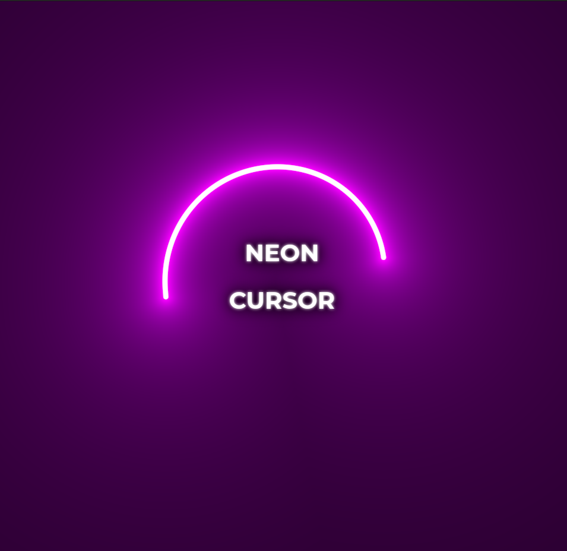

# Cursor Trail Effect 💡✨

Welcome to Neon Cursor, a fun and interactive web app that brings a futuristic touch to your browsing experience by adding a vibrant neon glow effect to your mouse cursor. Customize the look and feel of your cursor and make your website stand out with colorful animations.


## 📝 Description
Neon Cursor is designed to enhance user experience by turning the regular mouse pointer into a glowing, animated cursor. Whether you’re looking to add flair to your personal project or just have some fun, this app will light up your website with style!



## 💻 How to Run
Clone the repository:
```bash
git clone https://github.com/eldoJr/neon-cursor.git
```

----
Happy coding!